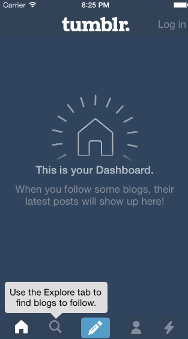

# tumblr #

The homework for Week 5.

Total time: ~8 hours

- [x] Tapping on Home, Search, Account, or Trending should show the respective
screen and highlight the tab bar button.
- [x] Compose button should modally present the compose screen.
- [x] Optional: Compose screen is faded in while the buttons animate in.
- [x] Optional: Login button should show animate the login form over the view
controller.
- [x] Optional: Discover bubble should bob up and down unless the
SearchViewController is tapped.

## Setup ##

Run `bin/setup`

This will:

 - Install the gem dependencies
 - Install the pod dependencies

## Testing ##

Run `bin/test`

This will run the tests from the command line, and pipe the result through
[XCPretty][].

[XCPretty]: https://github.com/supermarin/xcpretty
